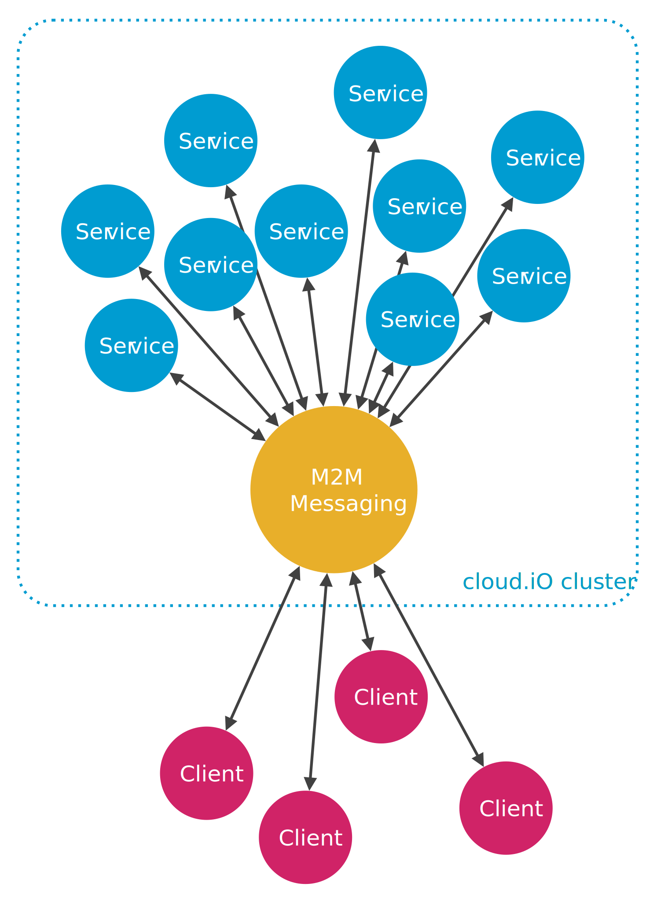

Building blocks
===============

cloud.iO is based on existing and mature open source technology. The following chapters will introduce the building blocks used to develop cloud.iO.

Message based microservice architecture
---------------------------------------

cloud.iO is based on a microservice architecture as illustrated in the following figure:

This has the following advantages:

* Simplicity
   * A complex system can be composed by many of simple services.
   * Most of those services are completely stateless.
* Scalability
   * Services can be spread over multiple computing nodes.
   * Services under high load can be dynamically deployed to additional computing nodes.
* Extensibility
   * The System can be extended by new services or services can be modified/updated without any need for system downtime.

Spring framework
----------------

The |Spring_framework| is a mature, modular, open-source Java EE application stack with focus on web and cloud development. It offers the following features
from a cloud.iO point of view:

* Lightweight and modular, ideal for microservices.
* Uses Java and Kotlin as main programming languages.
* Dependency injection and inversion of control allow decoupling of components and simplifies testing.
* Spring comes with an impressive amount of libraries and functionality to simplify developing.
* Spring offers excellent AMQP, JMS, Apache Kafka and STOMP messaging support.
* Spring offers support for many popular SQL and NoSQL databases.
* Spring is completely open source.

RabbitMQ
--------

|RabbitMQ_link| is a message **broker**: it accepts and forwards messages. You can think about it as a post office: when you put the mail that you want posting in a post box, you can be sure that Mr. Postman will eventually deliver the mail to your recipient. In this analogy, RabbitMQ is a post box, a post office and a postman.

The major difference between RabbitMQ and the post office is that it doesn't deal with paper, instead it accepts, stores and forwards binary blobs of data - messages.

RabbitMQ is stable, broadly used in production (Intagram as an example), scalable and has flexible message routing. User authentification and access rights are possible using multiple backends.

MQTT
----

|MQTT_link| (**M**\ essage **Q**\ ueue **T**\ elemetry **T**\ ransport) is a machine-to-machine (M2M) / IoT connectivity protocol. It was designed as an extremely lightweight publish/subscribe messaging transport. It is useful for connections with remote locations where a small code footprint is required and/or network bandwidth is at a premium.

The design principles and aims of MQTT are much more simple and focused than those of AMQP; it provides publish-and-subscribe messaging (no queues, in spite of the name) and was specifically designed for resource-constrained devices and low bandwidth, high latency networks such as dial up lines and satellite links, for example. Basically, it can be used effectively in embedded systems.

One of the advantages MQTT has over more full-featured “enterprise messaging” brokers is that its intentionally low footprint makes it ideal for today’s mobile and developing IoT style applications. In fact, companies like Facebook are using it as part of their mobile applications because it has such a low power draw and is light on network bandwidth.

Some of the MQTT-based brokers support many thousands of concurrent device connections. It offers three qualities of service.

MQTT’s strengths are simplicity (just five API methods), a compact binary packet payload (no message properties, compressed headers, much less verbose than something text-based like HTTP), and it makes a good fit for simple push messaging scenarios such as temperature updates, stock price tickers, oil pressure feeds or mobile notifications.

AMQP
----

|AMQP_link| (**A**\ dvanced **M**\ essage **Q**\ ueuing **P**\ rotocol) is a messaging protocol that enables conforming client applications to communicate with conforming messaging middleware brokers.

Messaging brokers receive messages from publishers (applications that publish them, also known as producers) and route them to consumers (applications that process them).

Since it is a network protocol, the publishers, consumers and the broker can all reside on different machines.

The AMQP Model has the following view of the world: messages are published to exchanges, which are often compared to post offices or mailboxes. Exchanges then distribute message copies to queues using rules called bindings. Then AMQP brokers either deliver messages to consumers subscribed to queues, or consumers fetch/pull messages from queues on demand.

**RabbitMQ** uses AMQP at its core.

.. figure:: _static/AMQP_hello.png
   :align: center
     
   https://www.rabbitmq.com/tutorials/amqp-concepts.html 

.. |Spring_framework| raw:: html

   <a href="https://spring.io" target="_blank">Spring framework</a>

.. |AMQP_link| raw:: html

   <a href="https://www.amqp.org/" target="_blank">AMQP</a>

.. |MQTT_link| raw:: html

   <a href="https://www.amqp.org/" target="_blank">MQTT</a>

.. |RabbitMQ_link| raw:: html

   <a href="https://www.rabbitmq.com/" target="_blank">RabbitMQ</a>
