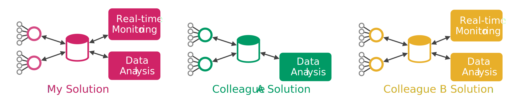

Motivation
==========

Many research projects need an infrastructure to monitor and control devices deployed to many different locations whereas in the most cases an internet
connection is available. In the past, each project handled those tasks differently which led to some issues:

   Redundant communication systems

* Each time a new solution for very similar problems were developed, which does not make sense from an economical point of view.
* Most of the projects do not dispose enough budget for the communication to create a stable/flexible solution.
* Data analyst has to work with a different database/control system for each single project.
* Data of different projects are not simple to compare and may have to be converted first.
* Scientists can not easily share their data with others.
* Remote control often is not possible, as a simple database is used at the center.
* Fine grained access control is not possible in the most cases.
* Monitoring is often very inefficient (Database Polling for example).

**cloud.iO** is our attempt to unify those recurring tasks in academic projects under in common base layer.
